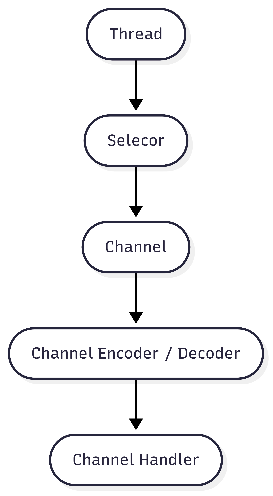
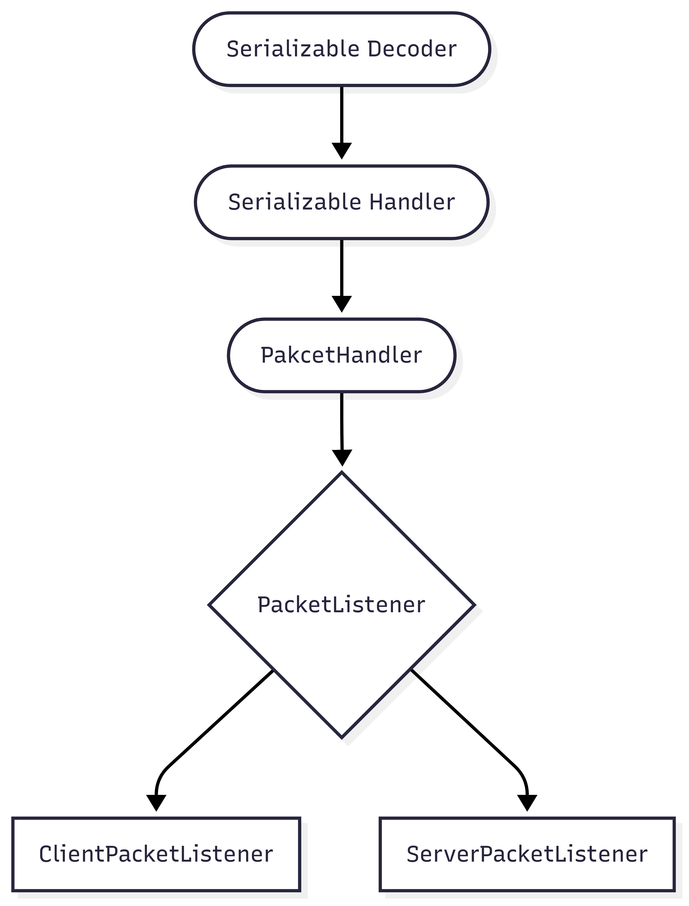
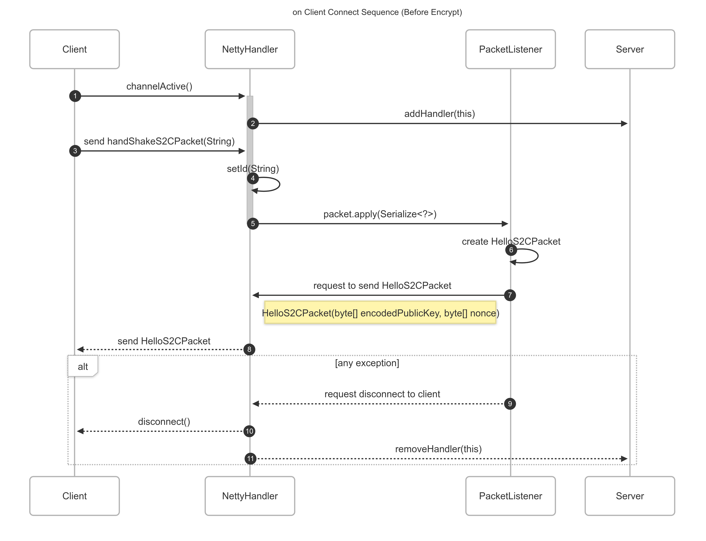

# Kiosk-Cafeteria-System

Netty 기반 Cafeteria kiosk 시스템입니다.

## Netty Pipeline

Netty의 기본 데이터 방식은 다음과 같다.  

서버가 실행되기 전 생성된 ThreadPool이 존재하며, 이 ThreadPool이 Selector를 통해 전송/수신 대상을 판단한다.  

이후 해당 채널을 통해 ByteBuffer를 전달하는데, 이 때 Channel에 있는 Pipeline 을 통해 전송된다.

Pipeline은 크게 ByteBuffer를 어떻게 데이터로 치환할지에 대한 Decoder, 데이터(인스턴스)를 어떻게 ByteBuffer로 바꿀지에 대한 Encoder, 그리고 이렇게 바뀐 데이터를 어떻게 다룰지에 대한 Handler가 존재한다.

## 프로젝트에서의 Pipeline

해당 FlowChart는 서버 / 클라이언트가 데이터를 전송받았을 때 어떠한 방식으로 핸들링 되는지에 대해서 서술되고 있다.

이를 글로 풀어쓰면,

1. [SerializableHandler](common/src/main/java/common/network/handler/SerializableDecoder.java)가 ByteBuf(바이트 버퍼)를 읽는다. 읽은 ByteBuf를 JsonObject로 변환한다. 이 JsonObject에서 패킷 ID를 추출하여 해당 ID에 맞는 Deserializer 를 불러온다. 이를 통해 역직렬화된 인스턴스를 Handler에게 전달한다.  
자세한 내용은 [Deserialization](doc/Deserialization.md)을 참고하라.   
2. [SerializableHandler](common/src/main/java/common/network/handler/SerializableHandler.java)는 이렇게 만들어진 [인스턴스](common/src/main/java/common/network/packet/Serializable.java)를 핸들링 한다. 이러한 인스턴스에는 공통적으로 `apply(PacketListener value)` 와 `getSide()` 가 존재하는데, 이에 맞지 않은 패킷은 각 사이드에서 핸들링 될 수 없다.
3. 각 핸들러등은 사이드에 알맞는 [PacketListener](common/src/main/java/common/network/handler/listener/PacketListener.java)를 가지고 있다. 이러한 PacketListener는 같은 패키지에 인터페이스인 [ClientPacketListener](common/src/main/java/common/network/handler/listener/ClientPacketListener.java)와 [ServerPacketListener](common/src/main/java/common/network/handler/listener/ServerPacketListener.java)가 존재하는데, 이들의 구현체는 각 사이드의 패키지에 있음을 유의하라. 이렇게 함으로서 각 사이드는 각자가 패킷을 어떻게 핸들링 하는 지 알 수 없다.

## Pipeline 암호화

해당 프로젝트는 [공개 키 암호화 방식](https://namu.wiki/w/%EA%B3%B5%EA%B0%9C%ED%82%A4%20%EC%95%94%ED%98%B8%ED%99%94%20%EB%B0%A9%EC%8B%9D)을 채용했다. 통신은 다음과 같은 방식으로 암호화 된다.

1. Client 가 서버와 접속된다. 이후, Client는 서버로 [HandShakeS2CPacket](common/src/main/java/common/network/packet/HandShakeC2SInfo.java)를 전송한다.   
2. 전송받은 서버는 [Nonce](https://www.ibm.com/docs/ko/was-nd/9.0.5?topic=services-nonce-randomly-generated-token)와 준비된 PublicKey를 인코드 한 형태로 [HelloS2CPacket](common/src/main/java/common/network/packet/HelloS2CPacket.java)에 데이터를 담아 클라이언트를 전송한다.  
3. 클라이언트는 전송받은 PublicKey를 RSA타입의 PublicKey로 복호화 하고 SecretKey를 작성한다.   
4. SecretKey와 Nonce를 PublicKey를 통해 암호화 하고, 이를 [KeyC2SPacket](common/src/main/java/common/network/packet/KeyC2SPacket.java)에 담아 전송한다.   
5. 클라이언트는 이 SecretKey를 통해 암호화/복호화를 위한 [Cipher](olab.research.google.com/drive/1YRY06MZHmb1JaAb22o9kyW22wD3LXXIr#scrollTo=4eaU9DEbJj1O)를 만들고, 이를 통해 [PacketEncryptor](common/src/main/java/common/network/encryption/PacketEncryptor.java) 와 [PacketDecryptor](common/src/main/java/common/network/encryption/PacketEncryptor.java)를 생성해 Pipeline에 등록한다.
6. Server는 전달받은 KeyC2SPacket을 받아 PrivateKey로 Nonce값을 복호화 해 해당 Nonce값을 증명한다. 이후 맞다면 SecretKey를 복호화 해 5번과 같은 수단을 진행한다. 만약 Nonce가 다르거나 복호화에 실패한다면 Exception이 발생해 연결이 끊김을 유의하라.

더 자세한 암호화 과정은 [Encyption.md](doc/Encryption.md)을 참조하라.

## API
클라이언트에서 서버로 패킷을 보내는 방법을 서술한다 . 해당 방식은 client 모듈에서만 싫행되어야 함을 유의하라. 